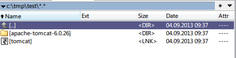

How to create symbolic link on NTFS
-----------------------------------

    mklink [[/D] | [/H] | [/J]] linkName target

* `/D` – Creates a directory symbolic link. Default is a file symbolic link.
* `/H` – Creates a hard link instead of a symbolic link.
* `/J` – Creates a Directory Junction.

To create symbolic link you need administrator priviledges. But not for *Directory Junction*.

Example:

    mklink /J tomcat apache-tomcat-6.0.26

